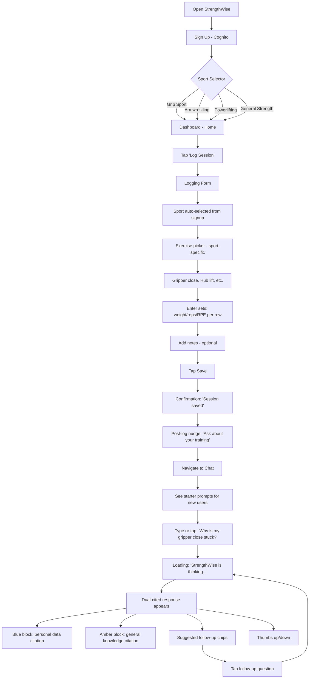
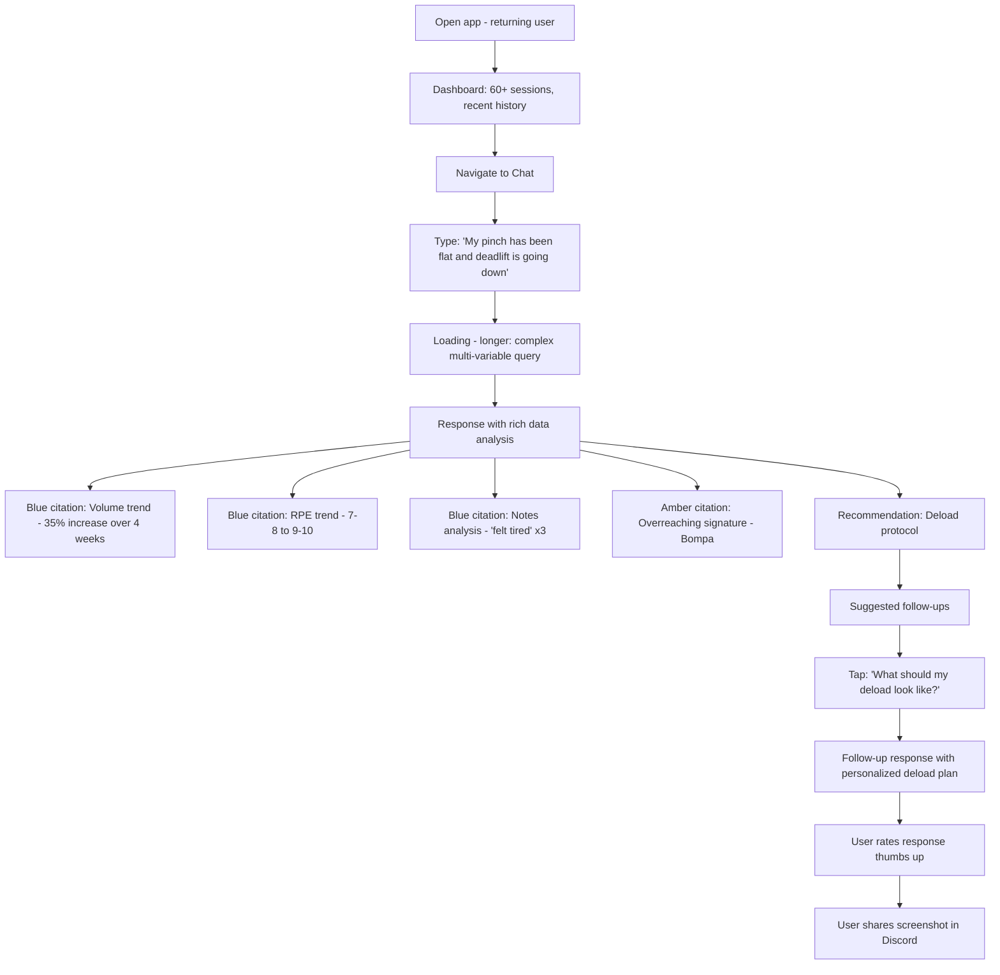
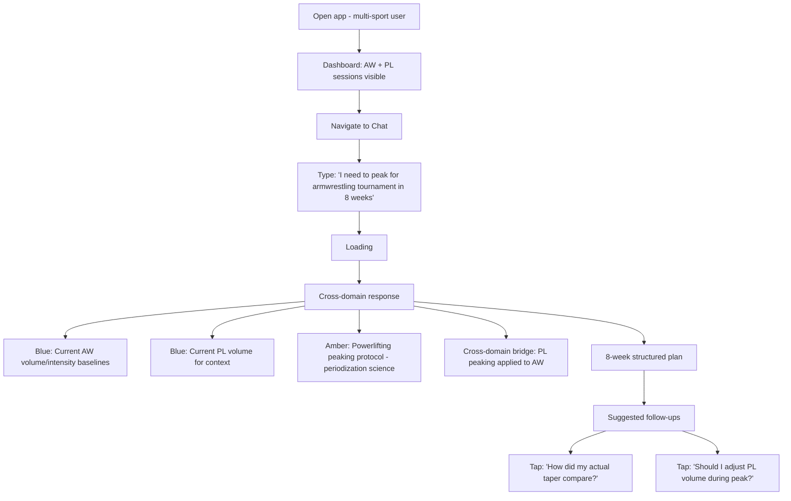
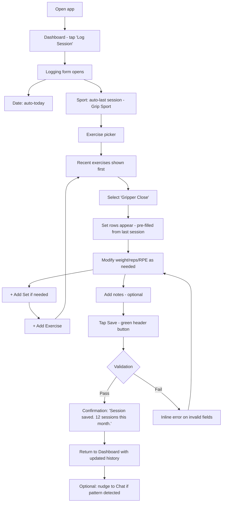
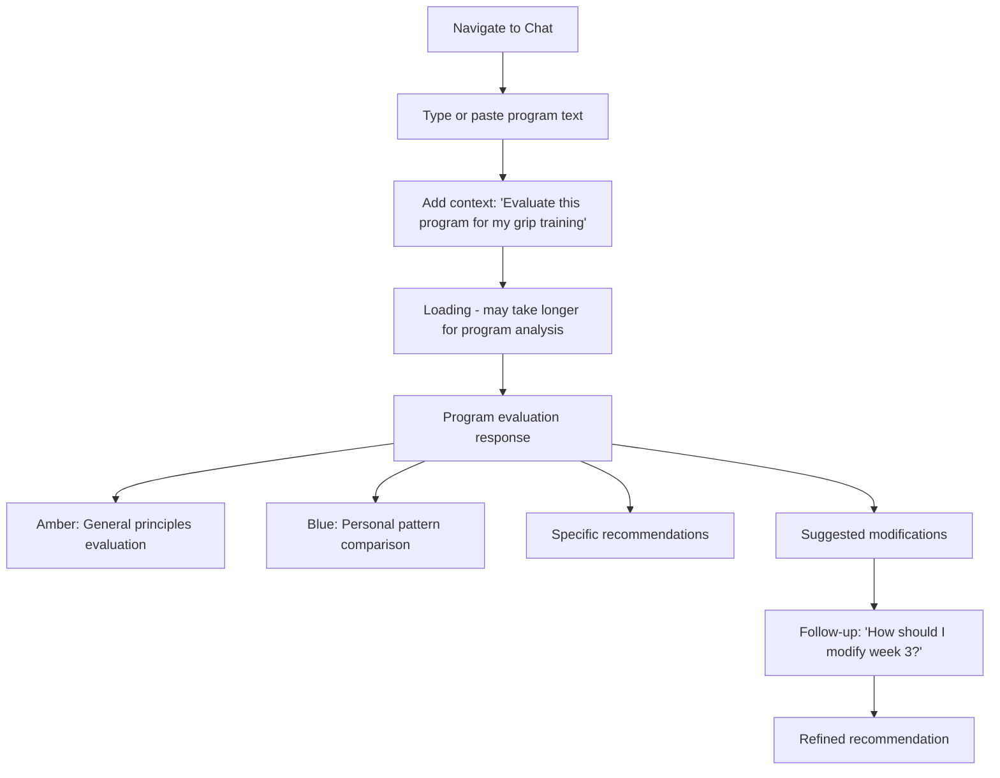

# UX Design Specification - StrengthWise

**Author:** Mr.A
**Date:** 2026-04-19

---

## Executive Summary

### Project Vision

StrengthWise is a conversational AI strength coach for niche sport athletes — grip, armwrestling, and powerlifting — that bridges two knowledge sources no existing tool combines: the athlete's personal training history and a curated general knowledge base of strength science. The UX must serve a single mission: collapse the five-tool workflow (spreadsheet + training book + ChatGPT + memory + manual analysis) into a single question with a cited answer. The architecture's deliberate split — free structured logging (no LLM) and on-demand AI coaching (LLM per query) — creates a UX with two distinct interaction modes that must feel like one seamless product.

The product is a mobile-responsive SPA with four core screens (Home/Dashboard, Session Logging, Chat/Query, History) served from S3 via CloudFront, backed by a serverless API (Lambda + API Gateway + DynamoDB + FAISS). There is no SEO requirement — athletes discover through community channels, not search engines. The primary device is a phone held post-session with sweaty hands and brain fog.

### Target Users

**Primary: The Dedicated Niche Athlete.** Age 22-40, trains 3-5x/week in grip sport, armwrestling, or powerlifting. Has 2+ years of training experience and accumulated data in spreadsheets they never revisit. Trains without systematic periodization. Cannot access or afford sport-specific coaching. Discovers tools through Reddit (r/GripTraining ~95K, r/armwrestling ~45K, r/powerlifting ~450K), GripBoard forums, and Discord servers. High conscientiousness, values mastery over quick results, skeptical of generic advice, and has zero tolerance for tools that don't speak their sport's language. Will not pay for generic fitness apps but will pay for something that genuinely understands their sport.

**Secondary: The Crossover Strength Enthusiast.** Age 25-45, trains multiple strength modalities (e.g., powerlifting + grip, strongman + armwrestling). Actively seeks knowledge transfer between disciplines. The cross-domain RAG capability is most valuable to this user — bridging principles they couldn't connect on their own.

**Tertiary: The Curious Beginner.** Age 18-30, recently discovered niche strength sport through social media. High enthusiasm, low knowledge, searching for structured guidance. Digital native who expects app-quality experiences.

### Key Design Challenges

1. **The "sweaty hands, post-session brain fog" test.** The logging form is the data flywheel — if it's slow or fiddly on a phone, athletes won't log consistently, and the system never accumulates the data that makes coaching valuable. Mobile-first, 44x44px touch targets minimum, auto-fill where possible, <30 seconds for a typical 4-exercise session.

2. **The 3-interaction trust window.** Market research confirms permanent adoption decisions happen within 2-3 sessions. The first dual-cited AI response — referencing both personal data and general knowledge — is the "aha" moment. If it feels generic, the user is lost forever. The UX must guide new users toward this moment as fast as possible.

3. **Dual-citation visual design.** AI responses cite two distinct source types: personal data ("your cycle 8 volume was 30% below...") and general knowledge ("Prilepin's chart suggests..."). These must be visually distinct and verifiable without cluttering the conversational flow. No existing fitness app has this pattern — it needs to be invented here.

4. **Sport-specific credibility at first contact.** The sport selector and exercise database must recognize niche implements immediately (gripper close, hub lift, pinch block, pronation, supination, side pressure). Failure to speak the athlete's language breaks trust instantly and permanently.

5. **Two interaction modes, one product.** Structured logging (fast, form-based, no AI) and AI coaching (conversational, slower, cited) are architecturally different but must feel like a unified experience. The transition between "log my session" and "ask about my training" should be seamless.

### Design Opportunities

1. **Cross-domain citations as a visual differentiator.** Making the bridge between disciplines visually compelling — "From powerlifting research..." styled distinctly from personal data references — creates screenshot-worthy moments that drive organic sharing in Reddit, Discord, and GripBoard. This is the primary growth mechanism.

2. **Progressive value disclosure.** The system gets smarter with more data. The UX can signal this explicitly ("Based on 3 sessions, early indicators suggest..." vs. "Based on 60 sessions, a clear pattern shows..."), creating a retention loop where athletes want to keep logging to unlock deeper insights. This is the compounding value that builds the data moat.

3. **Zero-to-value in one session.** Even without historical data, the general knowledge RAG can anchor sport-specific advice to a single logged session. The onboarding UX must make this first interaction feel valuable — not like a cold start waiting for data to accumulate.

4. **Suggested follow-up questions.** Athletes who don't know what to ask can be guided with contextual follow-ups after each AI response. This lowers the barrier to the "aha" moment and increases query engagement during the critical first week (10 queries/day onboarding limit).

## Core User Experience

### Defining Experience

StrengthWise has two interaction loops that form a single value chain:

**The Log Loop (daily, post-session).** Open app, tap "Log Session," select sport, pick exercises from sport-specific database, enter sets/reps/weight/RPE per exercise, add optional free-text notes, submit. Target: under 30 seconds for a typical 4-exercise session. No LLM involved — instant, free, works on slow connections. This is the data flywheel. Every logged session makes the coaching smarter.

**The Ask Loop (periodic, when curious or stuck).** Type a natural language question, receive a dual-cited response drawing from personal training history and general strength science, read and verify citations, optionally ask follow-ups or rate the response. This is where the value is experienced — but it depends entirely on the log loop feeding it data.

**The core action is logging.** It's the most frequent interaction, the hardest to get right on mobile, and the foundation everything else depends on. If logging is slow or annoying, athletes stop, data dries up, and coaching queries return thin answers. The coaching query is the core value moment, but logging is the core UX priority.

### Platform Strategy

**Mobile-responsive web app (SPA).** No native mobile app in v1. Static frontend served from S3 via CloudFront. Athletes access via mobile browser post-session and desktop browser for longer coaching conversations.

- **Primary device:** Mobile phone (post-session logging, quick queries)
- **Secondary device:** Desktop/laptop (deeper coaching conversations, program analysis, history review)
- **Touch-first design:** All interactive elements sized for touch (44x44px minimum), generous spacing, large form fields
- **No offline support in MVP.** The PRD defers PWA capabilities. A structured logging form submission is <1KB — if the user has enough connectivity to open the app, they can submit. Offline sync introduces conflict resolution complexity incompatible with a 7-day build. Revisit in v2 if gym connectivity proves to be a real barrier
- **No SEO required.** Content is behind authentication. Athletes discover through community channels (Reddit, GripBoard, Discord), not search engines
- **Browser support:** Modern evergreen browsers (Chrome, Safari, Firefox, Edge — latest 2 versions). Mobile Safari and Chrome are primary targets

### Effortless Interactions

**Logging must feel like muscle memory.** After 3-5 sessions, the athlete shouldn't think about the form — sport auto-selected from last session, recent exercises surfaced first, weight/reps pre-filled from last session's values as starting points. The form should adapt to the athlete's habits, not force them to re-specify context every time.

**Sport-specific exercise selection must be instant.** When a grip athlete opens the exercise picker, they see gripper close, hub lift, pinch block, wrist curl — not a generic alphabetical list starting with "Ab Crunch." The exercise database is pre-filtered by selected sport and sorted by the athlete's usage frequency.

**Asking a question must be as simple as texting.** A single text input, no configuration, no prompt engineering required. The system handles retrieval, citation, and formatting behind the scenes. Suggested follow-up questions appear after each response for athletes who don't know what to ask next.

**Date defaults to today.** The most common logging scenario is "I just finished training." Auto-fill today's date. Allow override for backdating, but don't make the athlete tap a date picker every session.

**Query count is visible but not intrusive.** Free-tier athletes see remaining daily queries (e.g., "7 of 10 queries remaining" during onboarding week, "2 of 3 remaining" after) — informative, not anxiety-inducing. No interstitial paywalls blocking the flow.

### Critical Success Moments

**Moment 1: First exercise recognition.** The athlete selects their sport and sees their specific exercises in the database. "Gripper close" appears. "Hub lift" appears. This is the first signal that the tool was built for them, not adapted from a generic fitness template. If this fails — if they have to manually type exercises that should be pre-loaded — trust breaks before any AI interaction occurs.

**Moment 2: First session logged in under 30 seconds.** The athlete finishes logging and thinks "that was fast." This is the moment they decide logging is sustainable. If it takes 2 minutes, they'll do it once and never return.

**Moment 3: First dual-cited AI response.** The athlete asks a question and receives an answer that references both their personal session data ("your last 3 sessions show...") and general strength science ("Prilepin's chart suggests..."). This is the "aha" moment — the instant they realize this is fundamentally different from ChatGPT. It must happen within the first 1-3 coaching interactions or the user is lost permanently.

**Moment 4: First cross-domain insight.** The athlete receives advice that bridges disciplines — powerlifting periodization applied to grip training, peaking protocols translated to armwrestling prep. This is the moment that generates screenshots shared in Discord and Reddit. It's the growth engine.

**Moment 5: "It remembers me."** After 2+ weeks of logging, the athlete asks a question and the response references patterns across multiple weeks or cycles. The system demonstrates accumulated understanding that no single ChatGPT session could replicate. This is the retention moment — the point where switching costs become real.

### Experience Principles

1. **Logging is sacred.** Nothing interferes with the logging flow. No pop-ups, no upsells, no tutorials mid-form. The fastest path from "app open" to "session saved" is always preserved. If there's a conflict between logging speed and any other feature, logging wins.

2. **Earn trust with specificity.** Every interaction should demonstrate sport-specific understanding. Generic language ("workout," "exercise," "rep") is replaced with sport-native language ("gripper close," "pronation work," "training cycle"). Citations in AI responses are specific ("your April 15 session, set 3") not vague ("your recent training").

3. **Show your work.** AI responses always cite sources — personal data citations and general knowledge citations, visually distinct. The athlete can verify any claim. Confidence levels are transparent ("based on 3 sessions, early indicators..." vs. "based on 60 sessions, a clear pattern..."). No black-box recommendations.

4. **Compound value visibly.** The UX should make the accumulating data advantage tangible. Session count, data richness indicators, and increasingly specific coaching responses all signal that the system is getting smarter about the athlete. This drives consistent logging and long-term retention.

5. **Mobile-first, desktop-enhanced.** Every flow works on a phone screen with sweaty hands. Desktop provides more space for chat history, side-by-side data views, and program analysis — but is never required. The phone experience is the product; desktop is a bonus.

## Desired Emotional Response

### Primary Emotional Goals

**"This was built for me."** The dominant emotional response StrengthWise must evoke. Niche strength athletes have spent years being ignored by fitness tech — every generic app reinforces the feeling that they're an afterthought. The moment a grip athlete sees "gripper close" in the exercise picker, or an armwrestler sees "pronation" recognized without manual entry, the emotional shift is: someone who trains this sport built this. That feeling of being understood is the emotional foundation everything else builds on.

**"I'm training smarter, not just harder."** After receiving a dual-cited coaching response, the athlete should feel empowered — like they've gained a capability they didn't have before. Not dependent on the tool, but augmented by it. The citation transparency ("here's why, and here's the evidence") feeds a sense of informed control rather than blind trust in a black box.

**"That was effortless."** Post-session logging should feel like a non-event — something that just happened, not something that required effort. The absence of friction is itself an emotional reward. Athletes who've struggled with spreadsheets and clunky apps will notice the difference immediately.

### Emotional Journey Mapping

| Stage | Desired Emotion | UX Trigger |
|-------|----------------|------------|
| **First open** | Curiosity + cautious hope | Sport selector with real niche options (not "build muscle / lose weight") |
| **First exercise pick** | Recognition + belonging | "Gripper close" in the list — "they know my sport" |
| **First session logged** | Satisfaction + surprise at speed | Under 30 seconds, confirmation feels clean |
| **First AI query** | Anticipation + mild skepticism | "Let's see if it actually knows anything..." |
| **First dual-cited response** | Revelation + excitement | "It referenced MY session AND a training principle I recognize" — the "aha" moment |
| **First cross-domain insight** | Intellectual delight | "I never connected powerlifting peaking to armwrestling prep before" |
| **Error / bad response** | Mild frustration, not anger | Clear error state, easy retry, visible feedback mechanism (thumbs down) |
| **Rate limit hit** | Informed acceptance, not punishment | "2 of 3 queries used today" shown proactively — no surprise walls |
| **Return visit (day 2+)** | Comfortable familiarity | Last sport auto-selected, recent exercises surfaced, "welcome back" not "start over" |
| **3-month milestone** | Deep trust + investment | Responses reference patterns across months — "it knows me now" |

### Micro-Emotions

**Confidence over confusion.** Every screen should make the next action obvious. No athlete should wonder "where do I log?" or "how do I ask a question?" The interface speaks their language and the paths are clear. Confidence is built through consistent, predictable interaction patterns.

**Trust over skepticism.** Citations are the trust mechanism. Every AI response shows its sources — personal data and general knowledge, distinctly styled. The athlete can verify any claim. Transparent confidence levels ("based on 3 sessions" vs. "based on 60 sessions") build trust through honesty rather than false certainty.

**Accomplishment over frustration.** Logging a session should feel like checking something off — a small win after a training win. The confirmation state should validate, not just acknowledge. "Session saved. You've logged 12 sessions this month." reinforces the compounding habit.

**Belonging over isolation.** These athletes train alone in garages and small gyms without coaches. StrengthWise should feel like having a knowledgeable training partner who remembers everything and knows the science — not like using a clinical tool. The tone is informed and direct, like talking to a fellow athlete who also reads training books.

### Design Implications

| Emotional Goal | UX Design Approach |
|---------------|-------------------|
| "Built for me" | Sport-native language throughout, niche exercises pre-loaded, no generic fitness imagery or terminology. Dark/neutral color palette that feels serious — not the bright pastels of mainstream fitness apps |
| "Training smarter" | Dual citations always visible, confidence levels transparent, suggested follow-ups guide deeper inquiry. Coaching responses feel educational, not prescriptive |
| "Effortless logging" | Minimal taps, smart defaults (last sport, today's date), recent exercises first, pre-filled weights from last session. Confirmation is instant and satisfying |
| Confidence | Clear visual hierarchy, obvious CTAs, consistent layout across screens. No hidden menus or ambiguous icons |
| Trust | Source citations styled distinctly (personal data vs. general knowledge), thumbs up/down on every response, explicit "not medical advice" disclaimer without being intrusive |
| Accomplishment | Session count visible on dashboard, "sessions this week/month" counter, coaching responses acknowledge data depth ("with 60 sessions of data, I can see...") |
| Belonging | Conversational tone in AI responses — knowledgeable peer, not clinical assistant. Sport-specific terminology used naturally, not explained patronizingly |

### Emotional Design Principles

1. **Serious tool for serious athletes.** No gamification, no virtual rewards, no confetti animations, no streaks. The market research is explicit: dedicated strength athletes actively reject these patterns. The emotional register is competent, focused, and respectful of the athlete's expertise. Think "training notebook that talks back" not "fitness app that celebrates you."

2. **Honesty builds loyalty.** When the system doesn't have enough data, say so. When confidence is low, signal it. When a cross-domain transfer is speculative, acknowledge it. Athletes trust tools that admit limitations more than tools that fake certainty. Transparent confidence > manufactured enthusiasm.

3. **Friction is the enemy of habit.** Every unnecessary tap, every extra screen, every moment of "wait, where do I..." erodes the logging habit. The emotional cost of friction compounds — what feels like a minor annoyance on day 1 becomes a reason to quit by day 30. Protect the frictionless feeling ruthlessly.

4. **Let insights create delight.** The "aha" moments — a cross-domain connection, a pattern surfaced from 3 months of data, an explanation for a stall the athlete couldn't diagnose alone — are the emotional peaks. The UX shouldn't manufacture delight through animations or rewards; it should surface genuine training insights that create real intellectual satisfaction.

5. **Respect the athlete's time and intelligence.** No onboarding tours, no tooltip tutorials, no "did you know?" pop-ups. These athletes are sophisticated enough to explore a 4-screen app. If the UX needs explaining, it's too complex. The interface should be self-evident to anyone who has logged training before.

## UX Pattern Analysis & Inspiration

### Inspiring Products Analysis

**1. Strong (Workout Tracker)**
Reddit's #1 recommended strength tracker with 3M+ users. Strong is the default incumbent that StrengthWise users will be coming from.

- **What it does well:** Minimal logging friction. Tap exercise, enter weight/reps, swipe to next set. The entire interaction model is optimized for speed. Clean visual hierarchy — the current workout is always front and center, history is one tap away. No clutter, no social features, no noise.
- **What keeps users coming back:** Reliability and speed. It never gets in the way. PR tracking gives a small reward loop without gamification. CSV export gives athletes confidence they own their data.
- **Lesson for StrengthWise:** Match Strong's logging speed or athletes won't switch. The logging form must feel at least as fast as Strong's, then the AI coaching layer is the reason to stay. Don't try to out-log Strong — out-think it.

**2. ChatGPT (Conversational AI)**
The interaction model athletes already use when they want training advice — and the one StrengthWise must surpass.

- **What it does well:** Zero learning curve. Type a question, get an answer. The conversational paradigm is instantly understood. Markdown formatting in responses makes structured information (lists, headers, bold) scannable. Suggested prompts lower the barrier for users who don't know what to ask.
- **What frustrates users:** No memory between sessions. No personal data integration. Generic advice that doesn't reference the athlete's actual training. Athletes have to re-explain their context every single time.
- **Lesson for StrengthWise:** Keep the conversational input model (single text field, type and send). Add what ChatGPT lacks — citations, personal data references, persistent context. Suggested follow-up questions are a proven pattern that reduces blank-screen anxiety.

**3. ArmProgress (Armwrestling Tracker)**
The closest niche competitor — purpose-built for armwrestling athletes.

- **What it does well:** Sport-specific exercise database that speaks the armwrestler's language (pronation, supination, side pressure, cupping). Premium analytics dashboards with "AI-powered Intelligent Reports." Built by armwrestlers, which gives it instant community credibility. The exercise picker understands the sport.
- **What it lacks:** No conversational coaching. Analytics are dashboards, not Q&A. No cross-domain knowledge. No general strength science integration. The "AI" is analytics visualization, not coaching.
- **Lesson for StrengthWise:** The sport-specific exercise database approach is validated — athletes respond to tools that know their implements. Replicate this for grip sport and powerlifting in addition to armwrestling. Then add the coaching layer ArmProgress doesn't have.

**4. Notion (Productivity/Notes)**
Not a fitness app, but relevant for how it handles structured data entry + free-form content in a single interface.

- **What it does well:** Seamlessly blends structured data (tables, databases, properties) with free-form text. The "/" command pattern for quick actions is intuitive. Templates reduce repetitive setup. The interface adapts to content type without mode switching.
- **Lesson for StrengthWise:** The logging form (structured) and chat interface (free-form) need to feel like they belong in the same app. Notion proves that structured and unstructured content can coexist without cognitive dissonance. The dashboard can borrow from Notion's approach of showing structured data (session history) alongside actionable inputs (quick-log button, chat field).

### Transferable UX Patterns

**Navigation Patterns:**

- **Bottom tab bar (mobile).** 3-4 tabs: Home/Dashboard, Log, Chat, History. This is the standard mobile navigation pattern used by Strong, ArmProgress, and most fitness apps. Athletes already know this pattern — no learning curve. The Log tab should be center or most prominent.
- **Persistent chat input.** A text input field visible on the Home/Dashboard screen (not just on the Chat tab) so athletes can ask a question without navigating away. Like a search bar that's always accessible. Inspired by how messaging apps keep the compose field persistent.

**Interaction Patterns:**

- **Inline set entry (from Strong).** Each exercise shows a stack of set rows. Tap to fill weight/reps/RPE per row. Add set with a "+" button. This is the fastest proven pattern for strength training logging. Don't reinvent this — replicate it.
- **Smart defaults (from fitness trackers).** Pre-fill weight and reps from the athlete's last session for the same exercise. The athlete can accept or modify. Saves 50%+ of taps on returning sessions.
- **Suggested follow-ups (from ChatGPT).** After each AI response, show 2-3 contextual follow-up questions the athlete might want to ask. Reduces the "what do I ask?" barrier, especially for new users who haven't built the habit of querying their data.
- **Pull-to-refresh (from mobile apps).** On the history/dashboard screen, pull down to refresh session data. Familiar mobile pattern that feels native.

**Visual Patterns:**

- **Dark mode as default.** Serious strength tools (JuggernautAI, many lifting calculators) use dark themes. Aligns with the "serious tool for serious athletes" emotional principle. Dark backgrounds also work better in gym lighting (bright overhead lights, variable conditions). Light mode available as option.
- **Card-based session display (from Strong).** Each logged session is a card showing date, sport, exercise count, and key metrics. Tappable for details. Scannable in a vertical list. Proven pattern for training history.
- **Distinct citation styling.** This is novel — no existing app has it. Use colored left-border accents on inline citation blocks: one color for personal data citations (e.g., blue — "your data"), another for general knowledge citations (e.g., amber — "from training science"). Inspired by how academic tools (Notion, research apps) handle source attribution, but adapted for conversational UI.

### Anti-Patterns to Avoid

1. **Onboarding questionnaires.** Generic fitness apps ask 10+ questions before the first action ("What's your goal? How often do you train? What's your experience level?"). Niche athletes find this patronizing and irrelevant. StrengthWise needs exactly one question at signup: sport/discipline selector. Everything else is inferred from usage.

2. **Gamification and streaks.** The market research and product brief are explicit: dedicated strength athletes actively reject virtual rewards, badges, streaks, confetti, and leaderboards. These patterns signal "this is for casual fitness consumers, not me." No streak counters, no achievement badges, no social comparisons.

3. **Interstitial paywalls.** Blocking the user mid-flow with "upgrade to premium" screens destroys trust, especially in communities hostile to monetization. Rate limits should be communicated proactively and transparently ("2 of 3 queries remaining today"), never as a surprise wall after the athlete has typed a question and hit send.

4. **Feature-stuffed dashboards.** Mainstream fitness apps cram calories, sleep, hydration, steps, and heart rate onto one screen. StrengthWise's dashboard should show exactly three things: recent sessions, a prominent log button, and a chat input. Clarity over comprehensiveness.

5. **Generic exercise illustrations.** Bodybuilding-style exercise illustrations (bicep curl stick figures, chest press diagrams) signal "this isn't for me" to niche sport athletes. Either use sport-specific imagery or use no illustrations at all — clean text and data is better than wrong visuals.

6. **Mandatory tutorial flows.** "Tap here to learn how to log!" tooltip sequences that block interaction. A 4-screen app doesn't need a tutorial. If the UX requires explaining, simplify the UX, don't add a tour on top of it.

### Design Inspiration Strategy

**What to Adopt:**

- Strong's inline set entry pattern for the logging form — proven fastest for strength training data entry
- ChatGPT's conversational input model (single text field, suggested follow-ups) for the coaching interface
- Bottom tab bar navigation (Home, Log, Chat, History) — familiar mobile pattern, zero learning curve
- Card-based session display for training history — scannable, tappable, proven
- Dark mode as default — aligns with serious athlete identity and gym lighting conditions
- Smart defaults (pre-fill from last session) — reduces taps by 50%+

**What to Adapt:**

- ArmProgress's sport-specific exercise database approach — expand to cover grip sport and powerlifting, not just armwrestling
- Notion's structured + free-form coexistence — adapt for the dashboard that shows structured session data alongside a conversational chat input
- Academic citation styling — adapt colored-border inline citations for conversational UI, distinguishing personal data (blue) from general knowledge (amber)

**What to Avoid:**

- Multi-step onboarding questionnaires (conflicts with "respect the athlete's time")
- Gamification, streaks, badges (conflicts with "serious tool for serious athletes")
- Interstitial paywalls (conflicts with trust-building emotional goals)
- Generic fitness imagery/illustrations (conflicts with "built for me" emotional goal)
- Feature-dense dashboards (conflicts with mobile-first, clarity-focused design)
- Mandatory tutorials (conflicts with "if the UX needs explaining, it's too complex")

## Design System Foundation

### Design System Choice

**Tailwind CSS + Headless Components** — utility-first CSS framework with unstyled, accessible component primitives.

- **CSS Framework:** Tailwind CSS v3+ — utility classes for all styling, purged in production for minimal bundle size
- **Component Behavior:** Headless UI (if React/Preact) or native HTML elements with ARIA attributes (if vanilla JS) — accessible interaction patterns without visual opinions
- **No pre-built component library** (no MUI, no Ant Design, no Bootstrap) — these impose visual identity and add bundle weight incompatible with a 4-screen mobile-first SPA

### Rationale for Selection

1. **Speed without sacrifice.** Tailwind's utility classes allow rapid UI development without writing custom CSS files. A solo developer building 4 screens in 7 days needs to move fast. Tailwind eliminates the CSS file proliferation problem while giving full visual control — no fighting a component library's opinions.

2. **Dark mode built-in.** Tailwind's `dark:` variant prefix handles dark/light mode at the utility level. Dark mode as default with light mode toggle is trivial — no theme provider setup, no CSS variable gymnastics.

3. **Mobile-first by default.** Tailwind's responsive prefixes (`sm:`, `md:`, `lg:`) enforce mobile-first thinking. Unprefixed utilities apply to mobile; larger breakpoints are additive. This matches the "mobile-first, desktop-enhanced" experience principle exactly.

4. **Minimal bundle size.** Tailwind purges unused CSS in production, resulting in a CSS payload typically under 10KB gzipped. For a mobile SPA served from CloudFront where time-to-interactive must be under 3 seconds on 4G, every kilobyte matters.

5. **No visual opinions to override.** MUI looks like Material Design. Ant Design looks like an enterprise dashboard. Both would require extensive customization to achieve the "serious tool for serious athletes" aesthetic. Tailwind starts from zero and builds up — the design is entirely ours.

6. **Framework-agnostic.** Whether the frontend ends up as React, Preact, or vanilla JS (Day 6 decision based on build progress), Tailwind works identically. No framework lock-in at the styling layer.

### Implementation Approach

**Design Tokens (Tailwind Config):**

- Extend Tailwind's default theme with StrengthWise-specific tokens:
  - Color palette: dark neutrals (slate/zinc), blue accent (personal data), amber accent (general knowledge), green for success states, red for errors
  - Spacing: generous touch targets (minimum p-3 / 12px padding on interactive elements, 44x44px minimum touch areas)
  - Typography: system font stack (no custom font loading — faster TTI), with size scale optimized for mobile readability
  - Border radius: minimal (2-4px) — clean, utilitarian aesthetic, not playful rounded corners

**Component Patterns:**

- Form inputs: Tailwind-styled `<input>`, `<select>`, `<textarea>` with consistent focus rings and label patterns
- Cards: Utility-composed div blocks for session cards, response cards
- Buttons: Primary (blue), secondary (outline), danger (red) — all with 44px minimum height on mobile
- Citation blocks: Left-bordered div blocks — blue border for personal data, amber border for general knowledge
- Chat bubbles: Simple div blocks with background color differentiation (user message vs. AI response)

**Responsive Strategy:**

- Base (mobile): single-column layout, full-width forms, stacked content
- `md:` (tablet/desktop): side-by-side panels where useful (chat history + input, session list + detail)
- `lg:` (wide desktop): maximum content width capped, generous whitespace

### Customization Strategy

**What we customize:**
- Color palette — dark-first with sport-accent colors for citation types
- Spacing scale — biased toward generous touch targets
- Component compositions — session cards, citation blocks, set entry rows are StrengthWise-specific patterns built from Tailwind utilities

**What we use as-is:**
- Tailwind's typography scale, responsive breakpoints, transition utilities, and accessibility features (focus-visible rings, sr-only classes)

**What we don't build:**
- No custom design system documentation site — overkill for a 4-screen app with one developer
- No Storybook or component library — the app IS the component library at this scale
- No design tokens file separate from `tailwind.config.js` — single source of truth in one config

## Defining Experience

### The Defining Interaction

**"Ask about your training and get a cited answer that knows you."**

The sentence an athlete uses to describe StrengthWise to a training partner: "I asked it why my gripper close stalled, and it pulled up my last three sessions AND a periodization principle, and explained exactly what was wrong." That's the defining experience — a natural language question that returns a response citing both the athlete's own data and general strength science.

This is StrengthWise's "swipe right" — the interaction that no other tool can deliver, that creates the screenshot shared in Discord, and that converts a skeptical athlete into a daily logger.

The logging form enables this moment. The exercise database validates credibility. But the dual-cited coaching response IS the product.

### User Mental Model

**Current approach (the five-tool workflow):**
1. Open spreadsheet -> find relevant training data
2. Open a training book or forum post -> find the relevant principle
3. Open ChatGPT -> write a prompt combining both
4. Re-explain training context because ChatGPT forgot everything
5. Get a generic answer that doesn't reference anything specific

Nobody actually completes all five steps. Most athletes stop at step 1 ("I'll look at my spreadsheet later") or skip to step 3 (ChatGPT with no personal data). The insight extraction never happens.

**StrengthWise mental model:**
1. Type a question -> get a cited answer

The athlete's mental model should be: "I'm talking to a coach who has read all my training logs and all the relevant books." Not a tool, not a database query, not a prompt — a conversation with a knowledgeable entity that remembers everything. The chat interface reinforces this: message bubbles, conversational tone, follow-up questions.

**Where confusion could happen:**
- Athletes may not understand what the system "knows" about them early on (few sessions logged). The UX must set expectations: "Based on your 2 logged sessions..." makes the data scope explicit.
- Athletes may expect real-time coaching ("should I add weight to this set right now?"). StrengthWise is async coaching — post-session reflection, not mid-session guidance. The UX should not suggest real-time use.
- Athletes may not know what to ask. Suggested follow-up questions and starter prompts ("Try asking: 'Why did my [exercise] stall?'") lower this barrier.

### Success Criteria

| Criterion | Measurement | Threshold |
|-----------|-------------|-----------|
| Response references personal data | Every coaching response cites at least one specific session, date, or metric from the athlete's history | 100% of responses with sufficient data (3+ sessions) |
| Response references general knowledge | Every coaching response cites at least one principle, source, or training concept from the knowledge base | 100% of responses |
| Citations are verifiable | Personal citations link to specific session dates; knowledge citations name the source | Athletes can trace any claim |
| Response feels sport-specific | Uses sport-native language (not generic fitness language) | "gripper close," not "hand exercise" |
| Response time | From question submission to full response displayed | Under 10 seconds (NFR2) |
| First "aha" moment | Dual-cited response that references both personal data and general science | Within first 1-3 coaching queries |
| Athlete understands confidence level | Response transparently signals how much data backs the recommendation | "Based on 3 sessions..." vs. "Based on 60 sessions..." |

### Novel UX Patterns

**Novel: Dual-citation inline blocks.**
No existing chat UI distinguishes between two types of cited sources within a single response. StrengthWise needs a visual pattern where:
- Personal data citations appear in blue-bordered blocks: "Your April 15 session: gripper close 4x3 @ RPE 9, total volume 12 sets"
- General knowledge citations appear in amber-bordered blocks: "Prilepin's Chart suggests 4-10 total reps for near-maximal efforts (>90% intensity)"
- Both appear inline within the conversational response, not as footnotes or appendices

This is the most important novel UX pattern in the entire product. It must be immediately readable, not cluttered, and screenshot-worthy.

**Novel: Confidence-calibrated response framing.**
AI responses dynamically adjust their opening framing based on data volume:
- Low data (1-5 sessions): "Based on your first few sessions, early indicators suggest..."
- Medium data (6-30 sessions): "Looking at your recent training data..."
- High data (30+ sessions): "Based on 3 months of training data, a clear pattern shows..."

This is novel because no existing AI coaching tool transparently calibrates confidence to data volume. It builds trust through honesty.

**Established: Conversational chat interface.**
The chat input (single text field, send button, message bubbles) is a fully established pattern from ChatGPT, messaging apps, and support chat. Zero learning curve. Athletes already know how to use this.

**Established: Suggested follow-up questions.**
Clickable question chips below each AI response. Proven by ChatGPT and Google's "People also ask." Reduces blank-screen anxiety for new users.

**Established: Inline set entry for logging.**
The set-by-set row pattern (weight | reps | RPE per row, "+" to add set) is established by Strong and every major workout tracker. Don't innovate here — replicate the pattern athletes already know.

### Experience Mechanics

**1. Initiation:**
- **From Dashboard:** Athlete taps the chat input field on the home screen or navigates to the Chat tab
- **From post-log prompt:** After logging a session, a subtle nudge: "You've logged 5 sessions this week. Ask me anything about your training." with a link to chat
- **Starter prompts (new users):** For athletes with <5 sessions, show 3 suggested starter questions: "Why is my [exercise] stalling?", "How does my volume compare to recommended ranges?", "Analyze my training frequency"

**2. Interaction:**
- Athlete types a natural language question in the text input field
- No special syntax, no commands, no configuration — just type like texting a coach
- Send button (or Enter key on desktop) submits the query
- Loading state: subtle typing indicator ("StrengthWise is thinking...") with estimated response time
- System performs: embed query -> FAISS search for general knowledge -> DynamoDB fetch for personal data -> LLM call with combined context -> formatted response with citations

**3. Feedback:**
- Response appears as a chat bubble from StrengthWise
- Personal data citations rendered in blue-bordered inline blocks with session date and specific metrics
- General knowledge citations rendered in amber-bordered inline blocks with source name and principle
- Confidence framing in the opening sentence signals data depth
- 2-3 suggested follow-up questions appear as tappable chips below the response
- Thumbs up/down icons for response quality feedback
- Remaining query count updates: "2 of 3 queries remaining today"

**4. Completion:**
- The athlete has their answer — they can act on it in their next session, ask a follow-up, or rate the response
- Chat history persists (scrollable) so athletes can reference past responses
- No explicit "done" state — the conversation is ongoing, like a coaching relationship
- If rate limit reached: clear message with next reset time, no blocking UI

## Visual Design Foundation

### Color System

**Dark-first palette built on Tailwind's Zinc scale.** Zinc is a neutral gray with subtle warm undertones — more sophisticated than pure gray (Slate), less blue-tinted than cool gray. It reads as "professional tool" rather than "tech startup" or "fitness app."

**Base Colors (Dark Mode — Default):**

| Role | Token | Value | Usage |
|------|-------|-------|-------|
| Background | `bg-primary` | Zinc-900 (`#18181b`) | Main app background |
| Surface | `bg-surface` | Zinc-800 (`#27272a`) | Cards, panels, form inputs |
| Surface elevated | `bg-elevated` | Zinc-700 (`#3f3f46`) | Hover states, active elements, dropdowns |
| Border | `border-default` | Zinc-700 (`#3f3f46`) | Dividers, card borders |
| Text primary | `text-primary` | Zinc-100 (`#f4f4f5`) | Headings, primary content |
| Text secondary | `text-secondary` | Zinc-400 (`#a1a1aa`) | Labels, helper text, timestamps |
| Text muted | `text-muted` | Zinc-500 (`#71717a`) | Placeholders, disabled text |

**Accent Colors:**

| Role | Token | Value | Usage |
|------|-------|-------|-------|
| Personal data | `accent-personal` | Blue-400 (`#60a5fa`) | Personal citation borders, "your data" indicators |
| General knowledge | `accent-knowledge` | Amber-400 (`#fbbf24`) | Knowledge citation borders, "from science" indicators |
| Interactive/CTA | `accent-action` | Blue-500 (`#3b82f6`) | Primary buttons, links, active tab |
| Success | `accent-success` | Green-500 (`#22c55e`) | Session saved confirmation, positive indicators |
| Warning | `accent-warning` | Amber-500 (`#f59e0b`) | Rate limit approaching, caution states |
| Error | `accent-error` | Red-500 (`#ef4444`) | Form validation errors, failed actions |

**Light Mode (Toggle Available):**

| Role | Value |
|------|-------|
| Background | White (`#ffffff`) |
| Surface | Zinc-50 (`#fafafa`) |
| Surface elevated | Zinc-100 (`#f4f4f5`) |
| Border | Zinc-200 (`#e4e4e7`) |
| Text primary | Zinc-900 (`#18181b`) |
| Text secondary | Zinc-500 (`#71717a`) |

Accent colors remain the same in light mode — blue and amber have sufficient contrast against both dark and light backgrounds.

**Citation Block Styling:**

```
Personal data citation:
| Your April 15 session: gripper close 4x3 @ RPE 9
| Total volume: 12 working sets
(Blue-400 left border, Zinc-800 background, Blue-400/10 subtle background tint)

General knowledge citation:
| Prilepin's Chart: for >90% intensity, 4-10 total reps optimal
| Source: Periodization Theory and Methodology
(Amber-400 left border, Zinc-800 background, Amber-400/10 subtle background tint)
```

### Typography System

**System font stack — no custom fonts.** Custom font loading adds 100-300ms to TTI on mobile. For a 7-day build targeting <3s TTI on 4G, system fonts are the right call. The system stack looks native on every platform, loads instantly, and reads well at all sizes.

**Font Stack:**
```
font-family: -apple-system, BlinkMacSystemFont, 'Segoe UI', Roboto, 'Helvetica Neue', Arial, sans-serif;
```

**Type Scale (Mobile-First):**

| Level | Size | Weight | Line Height | Usage |
|-------|------|--------|-------------|-------|
| H1 | 24px / 1.5rem | 700 (Bold) | 1.25 | Screen titles ("Training Log", "Chat") |
| H2 | 20px / 1.25rem | 600 (Semibold) | 1.3 | Section headers ("Recent Sessions") |
| H3 | 16px / 1rem | 600 (Semibold) | 1.4 | Card titles (session date, exercise name) |
| Body | 16px / 1rem | 400 (Regular) | 1.5 | Chat messages, form labels, descriptions |
| Body small | 14px / 0.875rem | 400 (Regular) | 1.5 | Citation text, helper text, metadata |
| Caption | 12px / 0.75rem | 400 (Regular) | 1.4 | Timestamps, query count, disclaimers |
| Mono | 14px / 0.875rem | 400 (Regular) | 1.5 | Numbers in set data (weight, reps, RPE) |

**Key decisions:**
- Body text at 16px minimum — prevents iOS zoom on input focus and ensures mobile readability
- Monospace for numeric training data (weight, reps, RPE) — columnar alignment in set rows reads as structured data, not prose
- Bold (700) reserved for screen titles only — no bold in body text to maintain clean, utilitarian feel
- Line height 1.5 for body text — comfortable reading in chat messages

### Spacing & Layout Foundation

**Base unit: 4px.** All spacing is a multiple of 4px. Tailwind's default spacing scale (p-1 = 4px, p-2 = 8px, p-3 = 12px, p-4 = 16px, etc.) aligns with this.

**Key spacing values:**

| Token | Value | Usage |
|-------|-------|-------|
| `space-xs` | 4px (p-1) | Inline gaps (icon to label) |
| `space-sm` | 8px (p-2) | Within components (set row internal padding) |
| `space-md` | 12px (p-3) | Component padding (card padding, input padding) |
| `space-lg` | 16px (p-4) | Between components (card to card, section gap) |
| `space-xl` | 24px (p-6) | Section separators, major layout gaps |
| `space-2xl` | 32px (p-8) | Page-level padding (top/bottom margins) |

**Touch targets:**
- Minimum interactive element size: 44x44px (p-3 + content ensures this)
- Minimum gap between tappable elements: 8px
- Form inputs: height 48px (p-3 with 16px text), full-width on mobile

**Layout structure:**

```
Mobile (default, <768px):
+----------------------+
| Header (48px)        | -- App name + settings icon
+----------------------+
|                      |
|   Content area       | -- Full-width, single column
|   (scrollable)       |
|                      |
+----------------------+
| Tab bar (56px)       | -- Home | Log | Chat | History
+----------------------+

Desktop (md:, >=768px):
+-------------------------------------+
| Header                              |
+----------+--------------------------+
| Sidebar  |                          |
| Nav      |   Content area           |
| (200px)  |   (max-width: 720px)     |
|          |                          |
+----------+--------------------------+
```

- Mobile: bottom tab bar navigation (56px height, 4 tabs)
- Desktop: left sidebar navigation replaces bottom tabs
- Content max-width capped at 720px — prevents overly wide text blocks on large screens
- Page padding: 16px horizontal on mobile, 24px on desktop

### Accessibility Considerations

**Color contrast (WCAG 2.1 AA):**
- Text primary (Zinc-100) on Background (Zinc-900): contrast ratio ~15.4:1 (exceeds 4.5:1 requirement)
- Text secondary (Zinc-400) on Background (Zinc-900): contrast ratio ~5.3:1 (passes AA for normal text)
- Blue-400 accent on Zinc-900: contrast ratio ~5.1:1 (passes AA)
- Amber-400 accent on Zinc-900: contrast ratio ~8.5:1 (passes AA)
- All accent colors verified against both dark and light mode backgrounds

**Interactive elements:**
- Focus rings: 2px solid Blue-400 outline with 2px offset — visible on all backgrounds
- Focus-visible only (no focus ring on mouse click, only keyboard navigation)
- All form inputs have associated `<label>` elements
- ARIA attributes on custom components (dropdowns, tab bar, citation blocks)

**Motion and animation:**
- Minimal transitions: 150ms ease for hover states, 200ms for panel transitions
- `prefers-reduced-motion` media query respected — disable all animations when set
- No auto-playing animations, no infinite loops, no decorative motion

**Screen reader support:**
- Semantic HTML throughout (`<nav>`, `<main>`, `<article>`, `<form>`)
- Citation blocks have `aria-label` indicating source type ("Personal training data citation" / "General knowledge citation")
- Chat messages have `role="log"` with `aria-live="polite"` for new response announcements
- Query count announced to screen readers on change

## Design Direction Decision

### Design Directions Explored

Six design directions were generated as interactive HTML mockups (`ux-design-directions.html`), each emphasizing a different aspect of the product:

1. **D1: Dashboard-First** — Balanced home hub with log button + chat input + recent sessions. Surfaces all features from one screen.
2. **D2: Chat-Forward** — AI coaching experience front and center. Home screen leads with the chat interface.
3. **D3: Compact Logger** — Dense, efficient set entry inspired by Strong. Maximum data per screen, minimal scrolling. The "sweaty hands" champion.
4. **D4: Citation Showcase** — Prominent dual-source citation blocks with clear source labeling. Designed for the screenshot moment.
5. **D5: Card-Heavy** — Elevated surfaces, generous spacing, modern feel. Rounded cards create clear visual grouping.
6. **D6: Minimal Data-Forward** — Ultra-clean, borderless design. No card backgrounds — just content, dividers, and whitespace.

### Chosen Direction

**Hybrid approach — best screen for each purpose:**

| Screen | Direction | Rationale |
|--------|-----------|-----------|
| **Dashboard/Home** | D1 layout + D5 card styling | Balanced hub that surfaces all features. D5's card treatment adds polish and clear visual grouping without D1's potential clutter. Prominent "Log Session" button, inline chat input, recent session cards. |
| **Logging Form** | D3 Compact Logger | The logging form must be the fastest possible. D3's Strong-inspired inline set entry (weight/reps/RPE per row) is the proven pattern. Dense, efficient, large enough for sweaty hands. Smart defaults from last session. |
| **Chat/Coaching** | D4 Citation Showcase | The defining experience must look impressive. D4's prominent citation blocks with color-coded source labels (blue for personal data, amber for general knowledge) create the screenshot-worthy "aha" moment. Suggested follow-up chips below each response. |
| **History** | D6 Minimal Data-Forward | Training history is pure data retrieval. D6's borderless, content-only approach maximizes sessions per screen. Date-grouped, scannable, tappable for details. No visual noise. |

### Design Rationale

1. **Each screen has a different job.** The dashboard invites action, the logger captures data, the chat impresses with insights, and the history serves data lookups. One visual approach can't optimize for all four.

2. **Visual consistency through shared tokens, not identical layouts.** All screens use the same color palette (Zinc base, Blue/Amber accents), the same type scale, the same spacing system, and the same tab bar. The screens feel unified without being identical.

3. **The logging form must not compromise on speed.** D3's compact approach is the only direction that could achieve <30 second logging for a 4-exercise session. More spacious directions (D5) would require too much scrolling.

4. **The chat must not compromise on citation impact.** D4's prominent citation blocks are the growth engine — screenshots shared in Discord and Reddit. D2's inline citations work but don't have the same visual punch. D4 is worth the extra vertical space because it's optimized for the defining experience.

5. **The history screen benefits from density.** Athletes checking their history want to scan quickly. D6's minimal approach shows the most sessions per screen without visual clutter. Cards (D1, D5) add polish but reduce density.

### Implementation Approach

**Shared across all screens (Tailwind config):**
- Color tokens: Zinc-900 background, Zinc-800 surfaces, Blue-400/Amber-400 accents
- Type scale: System font stack, 16px body, monospace for numbers
- Spacing: 4px base unit, 44px minimum touch targets
- Bottom tab bar: 56px, 4 tabs (Home, Log, Chat, History), consistent across screens
- Header bar: 48px, screen title + contextual info (query count, save button)

**Per-screen implementation:**
- Dashboard: Card components with Zinc-800 background, 8px border-radius, 12px padding. Stats summary card with gradient accent. Inline chat input field.
- Logger: Inline set entry grid (set# | weight | reps | RPE), Zinc-800 exercise blocks, dashed "Add Set"/"Add Exercise" buttons. Green save button in header.
- Chat: Full-width message bubbles. Citation blocks with colored left border (3px) + tinted background (color/10 opacity) + source label. Suggested follow-up chip row. Thumbs up/down feedback.
- History: Borderless session rows with date group headers. Monospace set counts right-aligned. Bottom dividers only (1px Zinc-800).

## User Journey Flows

### Journey 1: First Session to "Aha" Moment (Marcus)

**Goal:** New user signs up, logs first session, asks first coaching question, receives dual-cited response.
**Target:** Complete in under 10 minutes. "Aha" moment within first 1-3 queries.



**Screen-by-screen detail:**

1. **Sign Up (30 seconds):** Email + password via Cognito. Single post-signup question: "What do you train?" with sport selector (Grip Sport, Armwrestling, Powerlifting, General Strength). No other onboarding questions.

2. **Dashboard (5 seconds):** Empty state for new user. Prominent "Log Session" button. Text: "Log your first session to get started." Chat input visible but with hint: "Log a few sessions first, then ask me anything."

3. **Logging Form (25 seconds target):** Sport pre-selected from signup choice. Exercise picker shows sport-specific exercises first (gripper close, hub lift, pinch block for Grip Sport). Inline set entry: weight | reps | RPE per row. "+" to add set, "+" to add exercise. Notes field at bottom. Green "Save" button in header.

4. **Post-Log Confirmation:** "Session saved. You've logged 1 session." Nudge: "Log 2-3 sessions and ask me anything about your training." Link to Chat tab.

5. **Chat - First Query:** Starter prompts visible for users with <5 sessions: "Why is my [exercise] stalling?", "How does my volume compare to recommended ranges?", "Analyze my training frequency." User types or taps a prompt. Response appears with dual citations. Suggested follow-ups below.

### Journey 2: Stall Diagnosis After 3 Months (Marcus)

**Goal:** Experienced user with 60+ sessions asks about a multi-variable problem. System surfaces cross-session patterns the user couldn't see.



**Key UX considerations:**
- Response confidence is high: "Based on 60 sessions over 3 months, a clear pattern shows..."
- Multiple personal data citations in a single response (volume trend, RPE trend, notes analysis) — each in its own blue-bordered block
- The notes analysis ("felt tired" x3) demonstrates that free-text notes are first-class data
- The cross-session pattern (overreaching) is something no single ChatGPT conversation could surface

### Journey 3: Cross-Domain Discovery (Elena)

**Goal:** Multi-sport athlete asks about peaking for armwrestling competition. System applies powerlifting periodization principles to armwrestling context.



**Key UX considerations:**
- Multi-sport session tagging is visible on the dashboard — Elena sees both AW and PL sessions
- The cross-domain bridge (applying PL peaking to AW) is the unique moment — consider a distinct visual treatment, perhaps a purple accent to indicate "cross-domain transfer"
- The structured multi-week plan should be formatted as a scannable list (Week 1-3: ..., Week 4-5: ..., etc.), not a wall of text
- Post-competition retrospective ("How did my actual taper compare?") demonstrates long-term memory value

### Journey 4: Session Logging (Daily Core Loop)

**Goal:** Returning athlete logs today's training session in under 30 seconds.



**Timing breakdown (target: <30 seconds):**
- Open form: 0s (one tap from dashboard)
- Sport + date: 0s (auto-filled)
- Exercise 1: 3s (tap recent exercise, pre-filled sets appear)
- Modify 3-4 sets: 8s (change 2-3 values from pre-filled defaults)
- Exercise 2: 3s + 6s modify
- Exercise 3: 3s + 6s modify
- Exercise 4: 3s + 6s modify (if needed — many sessions are 3 exercises)
- Notes: 0-5s (optional)
- Save: 1s
- **Total: ~25-30 seconds for 4 exercises**

### Journey 5: Program Analysis

**Goal:** Athlete pastes a training program from a forum and gets it evaluated against general principles and personal patterns.



**Key UX considerations:**
- Program analysis uses the same chat interface — no separate screen needed
- The text input must handle multi-line paste (program can be 20+ lines)
- Response should structure the evaluation clearly: strengths, concerns, personal fit, suggested modifications
- Rate limit: program analysis counts as one query (same as /analyze endpoint)

### Journey Patterns

**Consistent patterns across all journeys:**

1. **Entry point pattern.** Every journey starts from the dashboard or tab bar. No deep navigation, no hidden menus. Maximum 1 tap from any tab to any primary action.

2. **Loading state pattern.** All AI queries show "StrengthWise is thinking..." with a subtle animation. For complex queries (multi-variable, program analysis), the loading state may include "Analyzing your training data..." to set expectations for longer waits.

3. **Citation display pattern.** Every AI response uses the same dual-citation visual system: blue-bordered blocks for personal data, amber-bordered blocks for general knowledge. Source labels always present. Consistent across all query types.

4. **Feedback pattern.** Every AI response shows thumbs up/down. Every session save shows a confirmation with session count. Every error shows inline validation (no modal pop-ups).

5. **Follow-up pattern.** Every AI response includes 2-3 suggested follow-up question chips. Tapping a chip sends it as a new query. This pattern is consistent whether the original query was typed, selected from starters, or tapped from a previous follow-up.

### Flow Optimization Principles

1. **Zero-tap defaults.** Date, sport, and exercise suggestions should require zero taps for the most common scenario (logging today's session in the same sport as last time, using the same exercises).

2. **Progressive data richness.** Flows adapt to data volume. New users see starter prompts and confidence-calibrated responses. Experienced users see richer citations and deeper pattern analysis. The flow is the same — the content depth scales.

3. **Error recovery is inline.** No modal error dialogs. Validation errors appear next to the offending field. API errors show a retry button in place. Rate limit messages show remaining count and reset time. The user never loses their place in a flow.

4. **The dashboard is the reset point.** After any completed action (session saved, chat conversation paused, history reviewed), the natural return is the dashboard. It's the "home base" that always shows current state and offers the next action.

## Component Strategy

### Design System Components

Tailwind CSS provides utility classes, not pre-built components. Every component is built from scratch using Tailwind utilities. Foundation patterns (focus rings, responsive prefixes, dark mode variants, spacing scale) are handled by Tailwind's config.

**Components needed (derived from user journeys and design direction):**

| Component | Used In | Priority |
|-----------|---------|----------|
| Tab Bar | All screens (navigation) | Critical |
| Header Bar | All screens | Critical |
| Session Card | Dashboard, History | Critical |
| Log Button (CTA) | Dashboard | Critical |
| Exercise Block | Logging form | Critical |
| Set Entry Row | Logging form | Critical |
| Chat Bubble (User) | Chat | Critical |
| Chat Bubble (AI) | Chat | Critical |
| Citation Block (Personal) | Chat | Critical |
| Citation Block (Knowledge) | Chat | Critical |
| Follow-up Chip | Chat | Critical |
| Chat Input Bar | Chat, Dashboard | Critical |
| Sport Selector | Logging form, Onboarding | Critical |
| Exercise Picker | Logging form | Critical |
| Form Input | Logging, Sign up | Critical |
| Confirmation Toast | Post-save, Post-action | High |
| Query Counter | Header, Chat | High |
| Starter Prompt Card | Chat (new users) | High |
| Feedback Buttons | Chat | High |
| Empty State | Dashboard (new user), History | Medium |
| Error Inline | Forms, API errors | Medium |
| Rate Limit Banner | Chat | Medium |

### Custom Components

**1. Citation Block**

- **Purpose:** Display a cited source within an AI coaching response — the most important novel component in the product.
- **Variants:**
  - `PersonalCitation` — Blue-400 left border (3px), blue-tinted background (rgba(96,165,250,0.08)), label "YOUR DATA" in Blue-400 uppercase
  - `KnowledgeCitation` — Amber-400 left border (3px), amber-tinted background (rgba(251,191,36,0.08)), label "TRAINING SCIENCE" in Amber-400 uppercase
- **Content:** Source label, citation text (session date + metrics for personal; principle name + source for knowledge), optional bold highlights
- **States:** Default only — citations are read-only display elements
- **Accessibility:** `aria-label="Personal training data citation"` / `aria-label="General knowledge citation"`, readable by screen readers as distinct regions
- **Sizing:** Full-width within chat bubble, 12px padding, 6px border-radius on right side, 0 on left (border side)

**2. Set Entry Row**

- **Purpose:** Capture one set of training data (weight, reps, RPE) within an exercise block.
- **Anatomy:** 4-column grid: Set number (read-only) | Weight input | Reps input | RPE input
- **Content:** Numeric inputs with monospace font. Pre-filled from last session's values as defaults.
- **States:** Default (pre-filled values in Zinc-400), edited (white text), focused (Blue-400 ring), error (Red-500 ring + inline message)
- **Actions:** Tab between fields, enter to advance to next row, swipe-left to delete set (mobile)
- **Accessibility:** Each input has `aria-label` ("Set 1 weight", "Set 1 reps", etc.), tab order flows left-to-right then down
- **Sizing:** Grid columns: 40px | 1fr | 1fr | 60px. Row height: 40px. Input padding: 8px.

**3. Exercise Block**

- **Purpose:** Container for one exercise within the logging form — holds exercise name, set rows, and add-set button.
- **Anatomy:** Exercise name header (with "Last: 4x3 @ 80kg" hint) | Set header row (Set | Weight | Reps | RPE) | Set entry rows | "+ Add Set" button
- **Content:** Exercise name from picker, last-session hint, N set rows
- **States:** Default, expanded (all sets visible), collapsed (if >6 sets, show "Show all X sets")
- **Actions:** Add set, remove set (swipe), reorder (drag — post-MVP)
- **Accessibility:** Exercise name as heading, set rows as list items
- **Sizing:** Zinc-800 background, 8px border-radius, 10px padding, 8px margin-bottom

**4. Follow-up Chip**

- **Purpose:** Suggested follow-up question displayed after an AI response.
- **Anatomy:** Pill-shaped container with question text
- **Content:** Short question text (max ~50 characters)
- **States:** Default (Zinc-800 bg, Zinc-400 text, Zinc-700 border), hover (Blue-500 border, Blue-400 text), tapped (submits as new query)
- **Actions:** Tap to send as new chat query
- **Accessibility:** `role="button"`, `aria-label="Ask follow-up: [question text]"`
- **Sizing:** Inline-block, 6px vertical padding, 12px horizontal padding, 16px border-radius, 12px font size

**5. Session Card**

- **Purpose:** Display a logged training session summary on the dashboard or history screen.
- **Variants:**
  - Dashboard variant (D1+D5): Zinc-800 background, 8px radius, shows sport tag, exercise count, set count, exercise list preview
  - History variant (D6): Borderless, bottom-divider only, date-grouped, monospace set count right-aligned
- **Content:** Date, sport name, exercise count, total sets, exercise name list (truncated)
- **States:** Default, tapped (navigates to session detail)
- **Actions:** Tap to view full session detail
- **Accessibility:** `role="article"`, `aria-label="Training session: [date] - [sport]"`
- **Sizing:** Dashboard: 12px padding, 8px margin-bottom. History: 12px vertical padding, 0 horizontal.

**6. Chat Input Bar**

- **Purpose:** Persistent input for typing coaching queries.
- **Anatomy:** Text input (rounded, full-width minus send button) | Send button (blue circle, arrow icon)
- **Content:** Placeholder text: "Ask about your training..."
- **States:** Empty (placeholder visible, send disabled), typing (text visible, send enabled), sending (input disabled, loading indicator)
- **Actions:** Type text, tap send (or Enter on desktop), auto-focus on chat tab open
- **Accessibility:** `aria-label="Ask a coaching question"`, send button `aria-label="Send question"`
- **Sizing:** 8px padding around bar, input 40px height with 20px border-radius, send button 40px circle

**7. Query Counter**

- **Purpose:** Show remaining daily AI query count.
- **Anatomy:** Text string: "X of Y queries remaining" or "X queries left"
- **Variants:**
  - Header variant: compact, 11px, Zinc-400 text
  - Chat variant: below response, 10px, Zinc-500 text, updates after each query
- **States:** Normal (Zinc-400), low (2 remaining — Amber-400), exhausted (0 — Red-400 with reset time)
- **Accessibility:** `aria-live="polite"` so screen readers announce changes

**8. Sport Selector**

- **Purpose:** Choose sport/discipline for session logging or onboarding.
- **Anatomy:** Segmented control or dropdown with 4 options: Grip Sport, Armwrestling, Powerlifting, General Strength
- **States:** Default (no selection — onboarding only), selected (Blue-500 highlight), auto-selected (from last session — logging form)
- **Actions:** Tap to select. On logging form, auto-selects last-used sport.
- **Sizing:** Full-width, 48px height per option (segmented) or standard dropdown

### Component Implementation Strategy

**Build order aligned with 7-day build plan:**

| Day | Components to Build | Rationale |
|-----|--------------------|-----------|
| Day 1-2 | Tab Bar, Header Bar, Form Input, Sport Selector | Scaffolding — needed for all screens |
| Day 2-3 | Exercise Block, Set Entry Row, Exercise Picker | Logging form — the core daily interaction |
| Day 3-4 | Chat Bubble (User/AI), Citation Block (both variants), Chat Input Bar | Chat interface — the defining experience |
| Day 4-5 | Follow-up Chip, Feedback Buttons, Query Counter, Starter Prompt Card | Chat enhancements — support the "aha" moment |
| Day 5-6 | Session Card (both variants), Confirmation Toast, Empty State | Dashboard + History screens |
| Day 6 | Error Inline, Rate Limit Banner | Error handling and edge cases |

**Component composition rules:**
- All components use Tailwind utility classes — no separate CSS files
- Shared tokens from `tailwind.config.js` (colors, spacing, border-radius)
- Components are composed in page-level templates, not abstracted into a separate library
- At 4 screens and ~20 components, the app IS the component library

### Implementation Roadmap

**Phase 1 — MVP Core (Days 1-6):**
All 22 components listed above. Every component is needed for the 4 core screens. No component is optional for the MVP — each supports a critical user journey.

**Phase 2 — Post-MVP Enhancements:**

| Component | Purpose | Trigger |
|-----------|---------|---------|
| Program Analysis Input | Multi-line text area with paste detection | If program analysis makes Day 5 cut |
| Data Export Button | Trigger CSV export with download | FR21 — user data ownership |
| Account Settings Panel | Profile, export, delete account | FR19-FR23 |
| Onboarding Welcome | First-time user empty state with guided first steps | If organic signups begin |
| Insight Notification | Proactive pattern alert card | v2 — proactive detection |

## UX Consistency Patterns

### Button Hierarchy

**Three-tier button system:**

| Tier | Style | Usage | Example |
|------|-------|-------|---------|
| **Primary** | Blue-500 bg, white text, full-width on mobile | One per screen maximum. The single most important action. | "Log Session", "Save", "Send" |
| **Secondary** | Transparent bg, Blue-500 border, Blue-500 text | Supporting actions that don't compete with primary. | "Export Data", "View All" |
| **Ghost** | Transparent bg, no border, Zinc-400 text | Low-emphasis actions, destructive actions (Red-500 text for delete). | "Cancel", "Delete Account" |

**Button rules:**
- All buttons: minimum 44px height on mobile, 12px horizontal padding, 600 font-weight
- Primary buttons: 8px border-radius, full-width on mobile, auto-width on desktop
- Only one primary button visible per screen at any time
- Disabled state: 50% opacity, `cursor-not-allowed`, no hover effect
- Loading state: spinner icon replaces text, button remains same size (no layout shift)

### Feedback Patterns

**Success feedback:**
- Session saved: Inline confirmation replacing the save button area. Green-500 checkmark + "Session saved. X sessions this month." Visible for 3 seconds, then returns to dashboard.
- No toast/snackbar overlays — feedback is inline where the action happened.

**Error feedback:**
- Form validation: Red-500 ring on invalid input + Red-500 error text below the field. Appears on blur or submit attempt. Clears on valid input.
- API error: Replace loading state with error message in-place + "Retry" button. "Something went wrong. Tap to retry." Never a modal dialog.
- No error pages — errors are always contextual and recoverable from the same screen.

**Warning feedback:**
- Rate limit approaching: Query counter turns Amber-400 at 1 remaining query. Text: "1 query remaining today."
- Rate limit reached: Query counter turns Red-400. Chat input disabled with message: "Daily limit reached. Resets at midnight." No interstitial paywall.

**Loading feedback:**
- AI query: "StrengthWise is thinking..." with subtle pulsing dot animation in the chat area. No spinner overlay.
- Session save: Save button shows spinner, then transitions to success state.
- Page load: Skeleton screens (Zinc-800 placeholder blocks) matching content layout. No blank screens.

### Form Patterns

**Input fields:**
- All inputs: Zinc-800 background, Zinc-700 border, 6px border-radius, 16px font size (prevents iOS zoom), 10-12px padding
- Focus state: Blue-400 ring (2px), border changes to Blue-500
- Error state: Red-500 ring, Red-500 border, error message below in Red-400 text (14px)
- Labels: Above input, 12px uppercase, Zinc-400, 600 font-weight, 0.5px letter-spacing
- Placeholder text: Zinc-500, normal case

**Numeric inputs (set entry):**
- Monospace font for weight, reps, RPE
- Center-aligned text within input
- `inputmode="decimal"` to trigger numeric keyboard on mobile
- Tap to select all text (easy replacement of pre-filled values)

**Text areas (notes, program analysis):**
- Same styling as inputs but with `resize: none` on mobile
- Max height: 120px on logging form notes (scrolls if exceeded)
- Max height: 200px on chat input for program paste

**Form submission:**
- Save button in header bar (not below form) — always visible without scrolling
- Submit on Enter key (desktop) for chat input only
- No form resets on error — preserve all entered data

### Navigation Patterns

**Bottom tab bar (mobile):**
- 4 tabs: Home, Log, Chat, History
- Active tab: Blue-500 icon + text
- Inactive tabs: Zinc-500 icon + text
- Tab bar height: 56px, always visible (never hidden on scroll)
- Tab transitions: instant (no animation between tabs — speed over polish)

**Left sidebar (desktop, md: breakpoint):**
- Same 4 navigation items as vertical list
- Active item: Blue-500 text + Blue-500/10 background
- Sidebar width: 200px, fixed
- Always visible — no hamburger menu, no collapsing

**Back navigation:**
- Logging form: left arrow in header bar returns to dashboard (with confirmation if unsaved changes)
- Session detail (from history): left arrow returns to history list
- No back button on main tab screens — tab bar handles all primary navigation

**Deep linking:**
- Each tab has a clean URL path: `/`, `/log`, `/chat`, `/history`
- Session detail: `/history/{session-id}`
- Chat preserves conversation state when navigating away and returning

### Empty States

**Dashboard (new user, 0 sessions):**
- "Welcome to StrengthWise" heading
- "Log your first session to get started." body text
- Primary "Log Session" button
- Chat input visible but with hint: "Log a few sessions first, then ask me anything."
- No illustrations, no mascots — just clear text and a CTA

**Chat (new user, <3 sessions):**
- Starter prompt cards: 3 suggested questions tailored to the user's selected sport
- "The more sessions you log, the better my answers get." subtitle
- Query counter visible showing generous onboarding limit (10/day)

**History (0 sessions):**
- "No sessions logged yet." centered text
- "Log Session" link/button

**Chat (rate limit reached):**
- Most recent conversation still visible (scrollable)
- Input bar disabled with message: "Daily limit reached. Resets at [time]."
- No overlay, no modal — just the disabled input with explanation

### Loading States

**Skeleton screens:** Used for initial page loads. Zinc-800 blocks matching the shape of cards, inputs, and text blocks. Subtle pulse animation (opacity 0.5 to 1.0, 1.5s cycle).

**Inline spinners:** Used for button actions (save, send). 16px spinner icon replaces button text. Button size unchanged.

**Chat thinking indicator:** Three pulsing dots in a small Zinc-800 bubble, left-aligned (AI side). Text below: "Analyzing your training data..." for complex queries.

**No full-page loading screens.** The app should feel instant for non-AI interactions. Only AI queries (FAISS + DynamoDB + LLM) have perceptible wait times.

### Confirmation Patterns

**Destructive actions require explicit confirmation:**
- Account deletion: "Delete your account and all training data? This cannot be undone." with Red-500 "Delete" button and Ghost "Cancel" button. NOT a modal — inline expansion in the settings area.
- No confirmation needed for: session save (success feedback is sufficient), sending a chat query, navigating away from a completed form

**Non-destructive actions confirm inline:**
- Session saved: green confirmation in-place
- Query sent: message appears in chat immediately, loading indicator shows system is working
- Export started: "Preparing your export..." inline, then download link appears

## Responsive Design & Accessibility

### Responsive Strategy

**Mobile-first, desktop-enhanced.** All CSS is written for the smallest viewport first. Larger breakpoints add layout complexity — they never restructure the core interaction.

**Mobile (default, <768px):**
- Single-column layout, full-width content
- Bottom tab bar navigation (56px)
- Header bar (48px) with screen title + contextual info
- Content area fills remaining space, scrollable
- All forms full-width, all buttons full-width
- Touch targets minimum 44x44px

**Tablet/Desktop (md: >=768px):**
- Left sidebar navigation replaces bottom tab bar (200px fixed)
- Content area centered, max-width 720px
- Chat screen: conversation area takes full width within content area
- Logging form: same single-column layout (wider inputs don't help — the grid structure is already optimal)
- History: potential for session list + detail side-by-side panel (stretch goal — not MVP)

**Large Desktop (lg: >=1024px):**
- Same as md: with more generous whitespace
- Content max-width remains 720px (wider content doesn't improve readability)
- No additional layout changes — the product is not a desktop power tool

### Breakpoint Strategy

**Using Tailwind's default breakpoints:**

| Breakpoint | Value | Layout Change |
|------------|-------|---------------|
| Default (mobile) | <768px | Single column, bottom tab bar, full-width content |
| `md:` | >=768px | Sidebar nav, centered content (max 720px), larger spacing |
| `lg:` | >=1024px | Same as md: with more whitespace — no structural change |

**No tablet-specific breakpoint.** Tablets in portrait use the mobile layout (bottom tab bar). Tablets in landscape trigger the md: breakpoint (sidebar nav). This simplifies implementation — two layouts, not three.

**Key responsive behaviors:**
- Tab bar: visible on mobile, hidden on md:+ (replaced by sidebar)
- Sidebar: hidden on mobile, visible on md:+
- Forms: always single-column (multi-column forms are slower on all devices)
- Chat messages: max-width 90% on mobile, max-width 70% on md:+
- Citation blocks: full-width within chat bubble on all breakpoints

### Accessibility Strategy

**Target: WCAG 2.1 Level AA.** This is the industry standard and covers the PRD's accessibility requirements (NFR18-NFR21). Level AAA is not pursued — the additional requirements (7:1 contrast, no time limits, sign language) don't add meaningful value for this user base.

**Color and contrast:**
- All text-on-background combinations verified at 4.5:1 minimum (normal text) and 3:1 minimum (large text/UI components)
- Color is never the sole indicator of state — error states use Red-500 color AND a text message AND a border change
- Citation blocks are distinguishable by label text ("YOUR DATA" / "TRAINING SCIENCE"), not just by border color — color-blind users can read the labels

**Keyboard navigation:**
- All interactive elements reachable via Tab key
- Focus order follows visual layout (top-to-bottom, left-to-right)
- Focus rings visible only on keyboard interaction (`focus-visible`), not on mouse click
- Skip-to-content link at top of page (hidden until focused)
- Chat: Enter submits on desktop, Tab navigates between follow-up chips
- Logging form: Tab moves between set inputs (left-to-right, top-to-bottom), Enter adds new set row

**Screen reader support:**
- Semantic HTML: `<nav>`, `<main>`, `<article>`, `<form>`, `<h1>`-`<h3>`
- All form inputs have `<label>` elements (not just placeholder text)
- Citation blocks: `aria-label` identifying source type
- Chat area: `role="log"` with `aria-live="polite"` for new messages
- Query counter: `aria-live="polite"` for count changes
- Tab bar items: `role="tab"`, active tab marked with `aria-selected="true"`
- Sport selector: `role="radiogroup"` with `role="radio"` per option

**Touch accessibility:**
- All interactive elements: minimum 44x44px touch target
- Minimum 8px gap between tappable elements
- No hover-only interactions — everything accessible via tap
- No gesture-only interactions in MVP (no swipe-to-delete — button-based instead)

### Testing Strategy

**Responsive testing (manual, Day 6-7):**
- Chrome DevTools device emulation: iPhone SE (375px), iPhone 14 (390px), iPad (768px), Desktop (1280px)
- Real device: test on Mr.A's phone (primary use case) — logging form timing, touch targets, chat readability
- Safari on iOS: test for form zoom behavior (16px font prevents auto-zoom), keyboard dismissal, viewport issues

**Accessibility testing (automated + manual):**
- Lighthouse accessibility audit: target score 90+
- axe-core browser extension: zero critical/serious violations
- Keyboard-only navigation test: complete all 5 user journeys without mouse
- VoiceOver (macOS/iOS): verify screen reader announces citations correctly, query counter updates, form labels

**No dedicated QA team.** Testing is dogfooding by Mr.A + the 2-3 inner circle training partners (Phase 2 go-to-market). Automated tools catch the measurable issues; real usage catches the experiential ones.

### Implementation Guidelines

**For the developer agent building the frontend:**

1. **Always use Tailwind's responsive prefixes.** Unprefixed = mobile. `md:` = tablet/desktop. Never write `@media` queries in CSS — use Tailwind's built-in system.

2. **Use semantic HTML first, ARIA second.** A `<button>` is better than `<div role="button">`. A `<nav>` is better than `<div aria-label="navigation">`. Only add ARIA attributes when semantic HTML doesn't cover the pattern (citation blocks, chat log, query counter).

3. **Test touch targets with a finger, not a cursor.** Chrome DevTools cursor is 1px. A finger is ~44px. If two tappable elements are within 44px of each other, they'll be mis-tapped post-session.

4. **Use `inputmode` for numeric fields.** `inputmode="decimal"` on weight/RPE inputs, `inputmode="numeric"` on reps/sets. This triggers the numeric keyboard on mobile without using `type="number"` (which has scroll-to-change behavior that's problematic in forms).

5. **Preserve form state on error.** Never clear form data on validation failure or API error. The athlete just typed 4 exercises of set data — losing it on a network hiccup would be rage-inducing.

6. **Use `prefers-reduced-motion` for all animations.** Wrap every CSS transition and animation in a media query check. When the user has reduced-motion enabled, skip all animations — loading indicators become static, skeleton screens don't pulse, transitions are instant.
